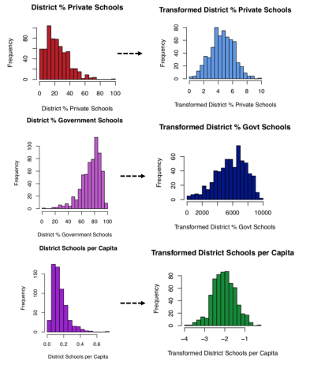
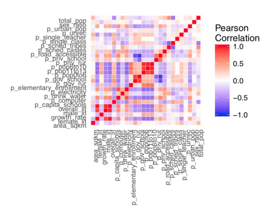
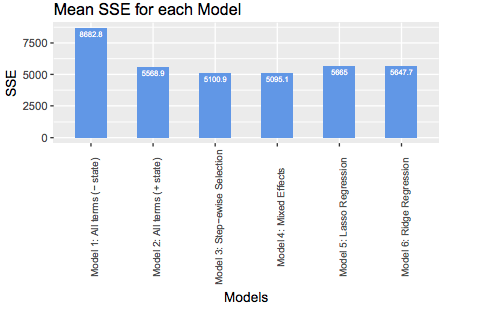
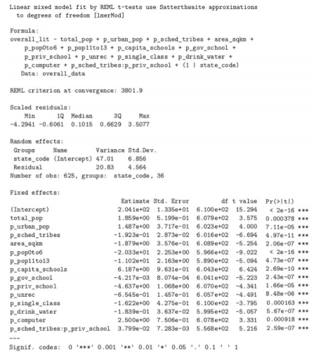

# Literacy Rates in India - A Statistical Analysis of Overall Literacy Rates Across India's 36 States and Union Territories

Project Participants: Ramtin Talebi, Rajet Vatsa, Paul Stainier, Mirai Shah

### Introduction

***“Education is the most powerful weapon which you can use to change the world.” - Nelson Mandela***

Education is a cornerstone of empowerment; it gives people agency and enables those who are disenfranchised to break out of cycles of poverty and low expectations. Unfortunately, in many developing countries around the world, illiteracy remains a prevalent issue. For India in particular, approximately one in four people are considered illiterate. This project, part of a Kaggle competition and the final project for a course in linear models, used a mixed effects linear model to gain a better understanding on the status of education in India.

Based on a district-by-district analysis of the hundreds of potential predictors in the Education in India database (https://www.kaggle.com/rajanand/education-in-india), we identified sets of attributes that are most strongly associated with and predictive of overall literacy rates.

### Approach

The original dataset had 625 observations and 819 variables, many of which were merely subcategories of overall district variables. We thus only considered the aggregate variables, such as total private schools rather than the number of private primary schools; we did this, in part, to ensure that the number of predictors would be substantially less than the number of observations. We settled on 25 variables, the complete list of which can be seen on page 1 of the Appendix above.

Ultimately, after performing EDA and structuring some messy data, we constructed a mixed effects linear regression model with carefully selected predictors, significant interaction terms, and a random intercept based on the state the school resided.

### Exploratory Data Analysis

We plotted histograms of each of the predictor variables at the district level and transformed them until they appeared normalize. A few are shown below:



In order to examine **multicollinearity**, we created a heat map of the correlation matrix of all our predictors:




### Code Snippets — Model Validation

We first built a wide array of models, from linear models with all individual predictors to models with every interaction term to models that used Lasso and Ridge Regression wiht optimized Lambda values.

In order to train and validate our models, we performed cross-validation, using the sum of squared errors (SSE) as our evaluation metric. This entailed fitting the model on a randomly chosen split of the training data, using the model to predict on the remaining portion, calculating the SSE, and iterating several times.

Finally, we compared the mean SSEs among models to identify the model with the lowest mean SSE (best predictive model), as follows:

```{r}
# Calculate mean SSE for Models 1-6
errors = c(mean(sse1), mean(sse2), mean(sse3), mean(sse4),
mean_lassos[which.min(mean_lassos)],
mean_ridges[which.min(mean_ridges)]
)

error_df <- data.frame(Models = c("Model 1: All terms (- state)",
                                  "Model 2: All terms (+ state)",
                                  "Model 3: Step-ewise Selection",
                                  "Model 4: Mixed Effects",
                                  "Model 5: Lasso Regression",
                                  "Model 6: Ridge Regression"),
                       SSE = errors)
                       
# Plot mean SSE for each model
ggplot(error_df, aes(Models, SSE)) +
          geom_bar(stat="identity",fill='cornflowerblue',width=.5)+
          geom_text(aes(label=round(SSE,1)),vjust=1.6,
                    color="white",size=2)+
          theme(axis.text.x = element_text(size=8, angle=90)) +
          ggtitle('Mean SSE for each Model')
```

Let's take a look at which model is best:



It appears that Model 4 - a linear mixed effects model where a random intercept was added based on state - is the most predictive.


### Insights

Below are the effects of some of the predictors of our model:



Model 4 focused on addressing the lack of independence in the data points in our previous models. Districts in the same state are dependent in that they are all affected by state government policies and state-specific cultural factors. Although Model 2 and Model 3 both control for state-level information by including the state code factor variable, 35 additional predictors are added as a result, causing the ratio of data points to predictors to decrease and thus potentially overfitting the data. Therefore, another way to address this violation of independence – a core assumption of multiple regression – is to build a mixed effects model, as we did in Model 4.

Our mixed effects model consisted of a random intercept based on state code and the 14 continuous variables selected in Model 3. A random intercept for state allowed us to resolve the hierarchical structure of the data by assuming different baseline values for each district, based on the state to which it belongs. The results from our mixed effects model were promising: the 14 continuous variables that were selected in Model 3 were all extremely significant (with p-values below 0.001), the coefficients were similar in value to those in Model 3, and the number of predictors significantly decreased, which prevents the chance of overfitting our data. 

### Conclusions

Overall, our analyses showed that the mixed effects model (Model 4) was the best predictive model
of overall literacy rates. The summary table of Model 4 is shown in Figure 9, with 14 significant
continuous predictors and a random intercept based on state. A key finding from our regression
analyses, which was consistent with our original hypothesis, was the importance of factoring in the
state a district was located in.


